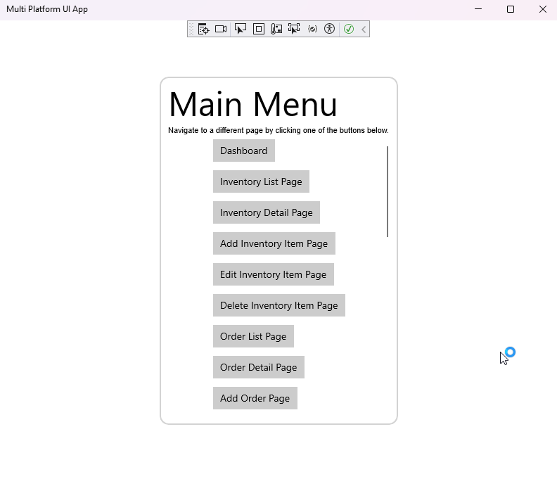
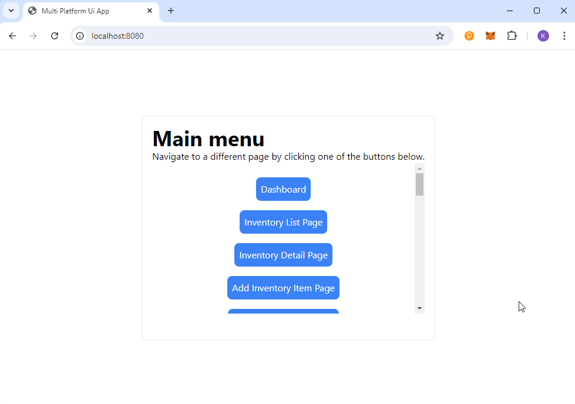
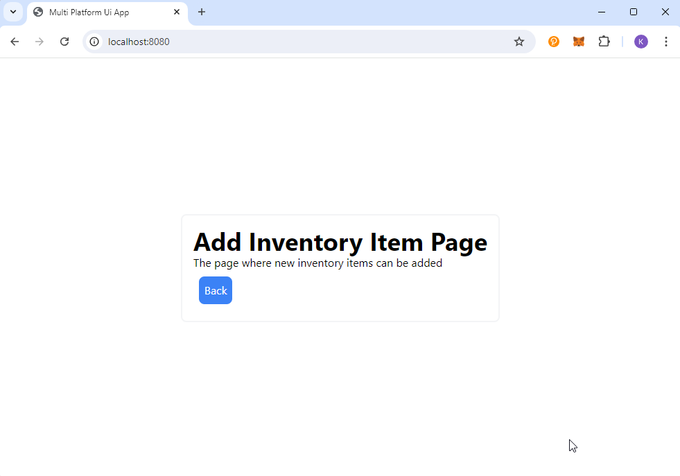
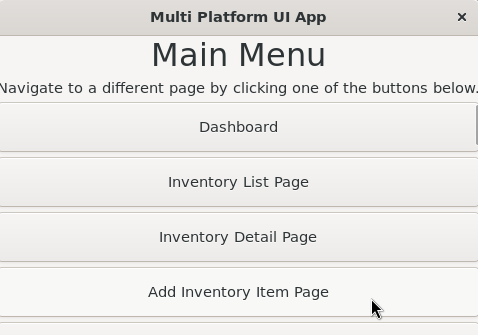
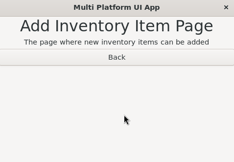

# ProJor Multi Platform UI App Example

This repository contains the source code for the ProJor Multi Platform UI App Example application. The repository uses [ProJor](https://docs.siocode.hu/projor), the model-based code generator to maintain most of the source code. See in the `.projor/` directory to examine the schema, model, and templates used to generate the code.

This example is documented [here](https://docs.siocode.hu/projor/full-examples/multi-platform-ui.html).

This repository generates the **same application** for **3 different platforms**:

* Universal Windows Platform (UWP)
* Web (React + Tailwind)
* Linux (GTK)

## Screenshots

_Universal Windows Platform (UWP)_

| Image 1 | Image 2 |
| --- | --- |
|  |  |
| _This screenshot shows how the main menu looks like on Windows, using UWP._ | _This screenshot shows how the product list page looks like on Windows, using UWP._ |

_Web (React + Tailwind)_

| Image 1 | Image 2 |
| --- | --- |
|  |  |
| _This screenshot shows how the main menu looks like on the web, using React and Tailwind._ |  _This screenshot shows how the product list page looks like on the web, using React and Tailwind._ |

_Linux (GTK)_

| Image 1 | Image 2 |
| --- | --- |
|  |  |
| _This screenshot shows how the main menu looks like on Linux, using GTK._ |  _This screenshot shows how the product list page looks like on Linux, using GTK._ |

## Platform Docs

Building & development instructions for the respective platforms are available in each platform project's own README file:

* [Universal Windows Platform (UWP)](windows-uwp/README.md)
* [Web (React + Tailwind)](web-react/README.md)
* [Linux (GTK)](linux-gtk/README.md)

## Generated Docs

The apps contain the following pages:

* **Dashboard**: The main dashboard providing an overview of warehouse operations
* **Inventory List Page**: The page that lists all items in the inventory
* **Inventory Detail Page**: The page that shows details of a specific inventory item
* **Add Inventory Item Page**: The page where new inventory items can be added
* **Edit Inventory Item Page**: The page for editing existing inventory items
* **Delete Inventory Item Page**: The page for deleting an inventory item
* **Order List Page**: The page that lists all customer orders
* **Order Detail Page**: The page that shows details of a specific customer order
* **Add Order Page**: The page for creating a new customer order
* **Edit Order Page**: The page for editing an existing customer order
* **Delete Order Page**: The page for deleting a customer order
* **Supplier List Page**: The page that lists all suppliers
* **Supplier Detail Page**: The page that shows details of a specific supplier
* **Add Supplier Page**: The page for adding a new supplier
* **Edit Supplier Page**: The page for editing an existing supplier
* **Delete Supplier Page**: The page for deleting a supplier
* **Shipment List Page**: The page that lists all shipments
* **Shipment Detail Page**: The page that shows details of a specific shipment
* **Add Shipment Page**: The page for adding a new shipment
* **Edit Shipment Page**: The page for editing an existing shipment
* **Delete Shipment Page**: The page for deleting a shipment
* **Stocktaking List Page**: The page that lists all stocktaking activities
* **Stocktaking Detail Page**: The page that shows details of a specific stocktaking activity
* **Add Stocktaking Page**: The page for initiating a new stocktaking activity
* **Edit Stocktaking Page**: The page for editing an existing stocktaking activity
* **Delete Stocktaking Page**: The page for deleting a stocktaking activity
